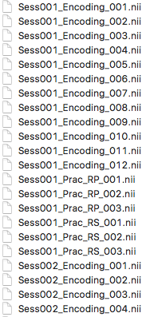
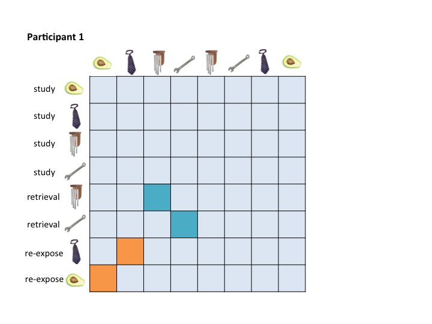
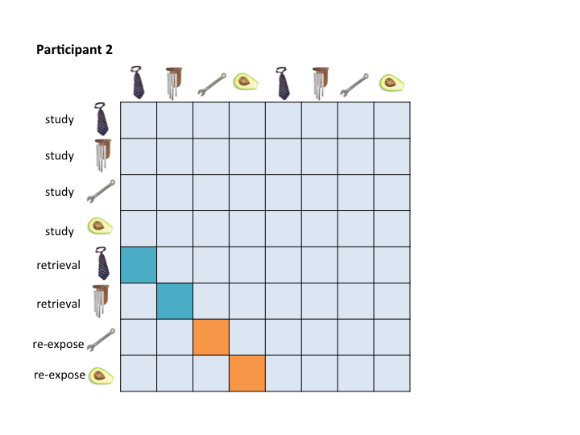
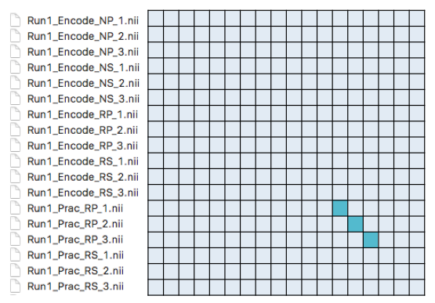

# rsa-beta-reorg
A tool for preparing your beta images for the RSA Toolbox

Introduction to the Function of this Notebook
---------------------------------------------

This notebook assumes knowledge of [LSS](https://www.researchgate.net/profile/Tyler_Davis7/publication/266027316_The_impact_of_study_design_on_pattern_estimation_for_single-trial_multivariate_pattern_analysis/links/560f387e08ae0fc513eed791.pdf) (Mumford et al., 2014) and of the [RSA Toolbox](http://www.mrc-cbu.cam.ac.uk/methods-and-resources/toolboxes/) (Nili et al., 2014).

The purpose of this workbook is to provide an example of how to prepare yourself to run representational similarity analyses (RSA) on specific trial pairs using the RSA Toolbox. It assumes that you have already completed LSS modeling of your trials (there are some notes on this step in the LSS Modeling section below.

An Example
----------

### Experimental Design

As with many cognition experiments, I had a unique randomized order of stimuli and conditions for each participant, which is very important if you plan on assessing within-run RSA (see Mumford et al., 2014). In my design, participants studied a series of items, followed by a phase that involved re-exposure to or retrieval practice of each of the items. Items were randomly assigned to each condition, and the order of the two conditions was intermixed. Here's an example that we will call Participant 1:    

The goal is to assess representational similiarity in the brain for a practice trial and its associated encoding trial (e.g., study of avocado with re-exposure to avocado).

### LSS Modeling

An LSS model was run on all trials to provide a single whole-brain beta image for each participant. The LSS method I used was provided by [tsalo](https://github.com/tsalo/misc-fmri-code/blob/master/lssGenerateBetasSpm.m) (note that I edited the script to be compatible with SPM12). This method produces a GLM for each trials of interest. The first regressor involves the trial of interest; indiviudal regressors are included for each condition, which allows you to adequately model nuisance variance associated with each condition. The method I used took betas from each model (for each trial for each participant) and renamed to reflect the trial number and condition. Here's a screenshot of the organization of some of the betas (cropped for brevity):    

Session refers to run number. In this example, I use two runs to give the general idea of how I looped through runs.

As you can see, the betas are grouped by condition, and the order within the condition reflects the presentation order of the trials within that grouping for that participant. In other words, the "RP" (retrieval practice) betas are grouped, and 001 was the first RP that this participant was shown

### RSA Toolbox

The toolbox provided by Nili et al. produces a correlation matrix for each run/session for all possible pairs of your betas, referred to as representational dissimilarity matrices (RDMs; these scores are in dissimiliarity space on a scale of 0 to 2, but by subtracting 1 and multiplying by -1, you can bring them back into correlation space with positive values indicating similiarity).

### The Problem

To assess pattern similiarity among trial pairs only, you will really only care about a couple of cells in your RDM. For example, I am only interested in correlation scores between my retrieval and re-exposure trials and their associated encoding event. Here's an example of how this would look for two participants:

 

The RSA Toolbox wants a mask that you can pass over the RDMs to extract only the cells that you care about. For example, you might want a retrieval practice mask that pulls out the teal cells, and a re-exposure mask that pulls out the orange cells. This is especially true if you are running a searchlight.

The problem is that no single mask maps onto these two example RDMs.

### The Solution

The cleanest solution is to reorganize your betas before you pass them to the RSA Toolbox so that you can pass a single mask to the tool box to extract the target values from your RDMs.

This code is designed to complete this reorganization task.

To address this organizational problem, this workbook takes beta images that were output by any LSS model, organizes them based on the criteria you specify in {r create new names}, and saves them with new names in a new folder. For example, they will be organized in a way that allows for them to be masked in a consistent way:

 

For this example, you could then pass these masks to the RSA Toolbox:

This function does not prep masks for you because they will depend on your design.

Using this Workbook
-------------------

If you would like to use this workbook, you must know two things:

1.  The script requires that you specify the order that you want your betas to be in when you send them to the RSA Toolbox. This step occurs in {r create new names}. The order of your betas will be highly specific to your project, so you must write your own code for this section. I have provided an example to facilitate understanding. In the example, I call csv files containing the order of trials for each participant to create a list of the new names for each beta image. I have documented this code in great deal (maybe excruciating detail!) to facilitate understanding.

2.  The list of new names is then sent to a generalized function that takes the old list of names, the new list of names, and file locations. It copies the betas and renames them.

### Setup Directories and Packages

Required R package:

-   tidyverse (for data frame manipulation)

In the provided example, the csv involves the presentation order for an individual participant. The column encode\_num included the presentation order during study, allowing for linking between the practice phase and the encoding phase. The column trial\_num maintains the presentation order, which reflects the output order of the betas. The script sorts by phase, then trial\_type, then encode\_num, which clusters items into their conditions, and then sorts them consistently within that condition, so that trial pairs can be found on a diagonal.

| sj  | run | trial\_num | context\_num | encode\_num | trial\_type | phase  | order\_in\_cond | new\_beta\_name                                |
|:----|:----|:-----------|:-------------|:------------|:------------|:-------|:----------------|:-----------------------------------------------|
| 4   | 1   | 1          | 1            | 1           | RP          | Encode | 1               | Data/reorg\_betas\_S04/Run1\_Encode\_RP\_1.nii |
| 4   | 1   | 2          | 1            | 2           | NP          | Encode | 1               | Data/reorg\_betas\_S04/Run1\_Encode\_NP\_1.nii |
| 4   | 1   | 3          | 2            | 3           | RS          | Encode | 1               | Data/reorg\_betas\_S04/Run1\_Encode\_RS\_1.nii |
| 4   | 1   | 4          | 2            | 4           | NS          | Encode | 1               | Data/reorg\_betas\_S04/Run1\_Encode\_NS\_1.nii |
| 4   | 1   | 5          | 3            | 5           | RS          | Encode | 2               | Data/reorg\_betas\_S04/Run1\_Encode\_RS\_2.nii |
| 4   | 1   | 6          | 3            | 6           | NS          | Encode | 2               | Data/reorg\_betas\_S04/Run1\_Encode\_NS\_2.nii |
| 4   | 1   | 7          | 4            | 7           | NP          | Encode | 2               | Data/reorg\_betas\_S04/Run1\_Encode\_NP\_2.nii |
| 4   | 1   | 8          | 4            | 8           | RP          | Encode | 2               | Data/reorg\_betas\_S04/Run1\_Encode\_RP\_2.nii |
| 4   | 1   | 9          | 5            | 9           | NS          | Encode | 3               | Data/reorg\_betas\_S04/Run1\_Encode\_NS\_3.nii |
| 4   | 1   | 10         | 5            | 10          | RS          | Encode | 3               | Data/reorg\_betas\_S04/Run1\_Encode\_RS\_3.nii |
| 4   | 1   | 11         | 6            | 11          | NP          | Encode | 3               | Data/reorg\_betas\_S04/Run1\_Encode\_NP\_3.nii |
| 4   | 1   | 12         | 6            | 12          | RP          | Encode | 3               | Data/reorg\_betas\_S04/Run1\_Encode\_RP\_3.nii |
| 4   | 1   | 25         | 2            | 3           | RS          | Prac   | 1               | Data/reorg\_betas\_S04/Run1\_Prac\_RS\_1.nii   |
| 4   | 1   | 26         | 5            | 10          | RS          | Prac   | 3               | Data/reorg\_betas\_S04/Run1\_Prac\_RS\_3.nii   |
| 4   | 1   | 27         | 1            | 1           | RP          | Prac   | 1               | Data/reorg\_betas\_S04/Run1\_Prac\_RP\_1.nii   |
| 4   | 1   | 28         | 3            | 5           | RS          | Prac   | 2               | Data/reorg\_betas\_S04/Run1\_Prac\_RS\_2.nii   |
| 4   | 1   | 29         | 6            | 12          | RP          | Prac   | 3               | Data/reorg\_betas\_S04/Run1\_Prac\_RP\_3.nii   |
| 4   | 1   | 30         | 4            | 8           | RP          | Prac   | 2               | Data/reorg\_betas\_S04/Run1\_Prac\_RP\_2.nii   |

| old\_names                                      | new\_names                                     |
|:------------------------------------------------|:-----------------------------------------------|
| Data/betas\_nii\_S04/Sess001\_Encoding\_001.nii | Data/reorg\_betas\_S04/Run1\_Encode\_RP\_1.nii |
| Data/betas\_nii\_S04/Sess001\_Encoding\_002.nii | Data/reorg\_betas\_S04/Run1\_Encode\_NP\_1.nii |
| Data/betas\_nii\_S04/Sess001\_Encoding\_003.nii | Data/reorg\_betas\_S04/Run1\_Encode\_RS\_1.nii |
| Data/betas\_nii\_S04/Sess001\_Encoding\_004.nii | Data/reorg\_betas\_S04/Run1\_Encode\_NS\_1.nii |
| Data/betas\_nii\_S04/Sess001\_Encoding\_005.nii | Data/reorg\_betas\_S04/Run1\_Encode\_RS\_2.nii |
| Data/betas\_nii\_S04/Sess001\_Encoding\_006.nii | Data/reorg\_betas\_S04/Run1\_Encode\_NS\_2.nii |
| Data/betas\_nii\_S04/Sess001\_Encoding\_007.nii | Data/reorg\_betas\_S04/Run1\_Encode\_NP\_2.nii |
| Data/betas\_nii\_S04/Sess001\_Encoding\_008.nii | Data/reorg\_betas\_S04/Run1\_Encode\_RP\_2.nii |
| Data/betas\_nii\_S04/Sess001\_Encoding\_009.nii | Data/reorg\_betas\_S04/Run1\_Encode\_NS\_3.nii |
| Data/betas\_nii\_S04/Sess001\_Encoding\_010.nii | Data/reorg\_betas\_S04/Run1\_Encode\_RS\_3.nii |
| Data/betas\_nii\_S04/Sess001\_Encoding\_011.nii | Data/reorg\_betas\_S04/Run1\_Encode\_NP\_3.nii |
| Data/betas\_nii\_S04/Sess001\_Encoding\_012.nii | Data/reorg\_betas\_S04/Run1\_Encode\_RP\_3.nii |
| Data/betas\_nii\_S04/Sess001\_Prac\_RP\_001.nii | Data/reorg\_betas\_S04/Run1\_Prac\_RS\_1.nii   |
| Data/betas\_nii\_S04/Sess001\_Prac\_RP\_002.nii | Data/reorg\_betas\_S04/Run1\_Prac\_RS\_3.nii   |
| Data/betas\_nii\_S04/Sess001\_Prac\_RP\_003.nii | Data/reorg\_betas\_S04/Run1\_Prac\_RP\_1.nii   |
| Data/betas\_nii\_S04/Sess001\_Prac\_RS\_001.nii | Data/reorg\_betas\_S04/Run1\_Prac\_RS\_2.nii   |
| Data/betas\_nii\_S04/Sess001\_Prac\_RS\_002.nii | Data/reorg\_betas\_S04/Run1\_Prac\_RP\_3.nii   |
| Data/betas\_nii\_S04/Sess001\_Prac\_RS\_003.nii | Data/reorg\_betas\_S04/Run1\_Prac\_RP\_2.nii   |

The outcome is a new folder with the reorganized betas. This organization will be the same for all participants, so these new betas can be fed into the RSA Toolbox and a single standardized mask can be used to pull out the same cells for every participant. For example, this mask will pull out the RP condition:

And that's all, folks! Happy RSAing!

\*\*NOTE: This example deviates from the method of the experiment for ease of exposition.
